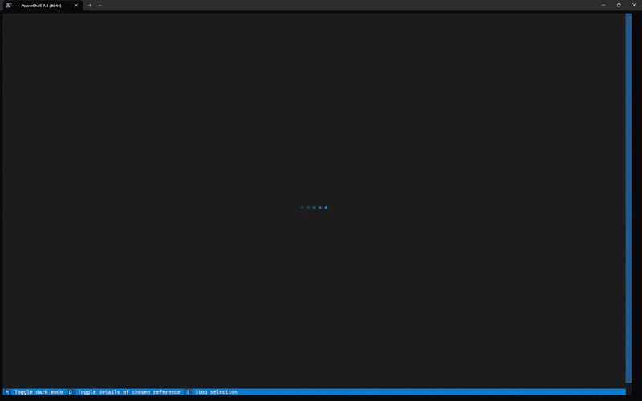

# eagerbib: Updating and normalizing your BibTex bibliography.

<p align="center">
  
</p>

## What is eagerbib?
eagerbib is a command line tool to update and normalize your BibTeX bibliography.
Specifically, you can use eagerbib to:
- Update references in your BibTeX file to their latest versions (e.g., 
  replace pre-prints with the final version)
- Normalize your bibliography (e.g., shorten conference names, remove duplicates, etc.)

For this, eagerbib uses a combination of offline and online methods. While the 
_offline_ methods are fully automatic and do not require any manual work or supervision,
the _online_ methods are only semi-automatic. That is, eagerbib will suggest possible
updates to you, but you have to manually confirm them. To make this process as comfortable
as possible, eagerbib features an easy to use interactive command line interface:

  


## Installation

Install eagerbib via pip:
```bash
pip install git+https://github.com/zimmerrol/eagerbib.git
```

To use the automated reference updater, you need to install a package of offline 
candidate bibliography files.
You can either compile your own list of bibliography files using `eagerbib-crawler` 
(for advanced users) or rely on the precompiled list of bibliography files provided by
[eagerbib-data](https://github.com/zimmerrol/eagerbib-data).

For example, to install the package containing bibliography information of machine
learning & computer vision conferences, run:
```bash
eagerbib-updater -b mlcv
```

Alternatively, you can also pass a URL to a tar.gz file containing the bibliography:
```bash
eagerbib-updater -b https://github.com/zimmerrol/eagerbib-data/raw/data/data/mlcv.tar.gz
```

## Usage

```bash
usage: eagerbib [-h] [--config CONFIG] --input INPUT --output OUTPUT [--bibliography-folder BIBLIOGRAPHY_FOLDER] [--online-updater.enable ONLINE_UPDATER.ENABLE] [--online-updater.n-suggestions ONLINE_UPDATER.N_SUGGESTIONS]
                [--online-updater.services ONLINE_UPDATER.SERVICES] [--online-updater.n-parallel-requests ONLINE_UPDATER.N_PARALLEL_REQUESTS] [--output-processor.name-normalizations OUTPUT_PROCESSOR.NAME_NORMALIZATIONS]
                [--output-processor.deduplicate OUTPUT_PROCESSOR.DEDUPLICATE] [--output-processor.shorten OUTPUT_PROCESSOR.SHORTEN] [--output-processor.sort OUTPUT_PROCESSOR.SORT] [--output-processor.remove-fields OUTPUT_PROCESSOR.REMOVE_FIELDS]
                [--output-processor.normalize-preprints OUTPUT_PROCESSOR.NORMALIZE_PREPRINTS]

optional arguments:
  -h, --help            show this help message and exit
  --config CONFIG, -c CONFIG
                        The config yaml file to use.
  --input INPUT, -i INPUT
                        The input bib file.
  --output OUTPUT, -o OUTPUT
                        The output bib file.
  --bibliography-folder BIBLIOGRAPHY_FOLDER, -l BIBLIOGRAPHY_FOLDER
                        Folder to load offline candidate bibliography files from.
  --online-updater.enable ONLINE_UPDATER.ENABLE
                        True to enable the online/semi-automated reference updater.
  --online-updater.n-suggestions ONLINE_UPDATER.N_SUGGESTIONS
                        Number of suggestions per service to show.
  --online-updater.services ONLINE_UPDATER.SERVICES
                        The services to use.
  --online-updater.n-parallel-requests ONLINE_UPDATER.N_PARALLEL_REQUESTS
                        Number of parallel requests. Higher values may lead to to less buffering while updating references but this requires sufficiently high network bandwidth.
  --output-processor.name-normalizations OUTPUT_PROCESSOR.NAME_NORMALIZATIONS
                        The list of conference name data.
  --output-processor.deduplicate OUTPUT_PROCESSOR.DEDUPLICATE
                        True to remove entries that are duplicates based oneither their properties or their ID.
  --output-processor.shorten OUTPUT_PROCESSOR.SHORTEN
                        True to shorten the conference names.
  --output-processor.sort OUTPUT_PROCESSOR.SORT
                        True to sort the output BibTeX entries alphabetically by ID.
  --output-processor.remove-fields OUTPUT_PROCESSOR.REMOVE_FIELDS
                        A list of fields to remove from the output entries.
  --output-processor.normalize-preprints OUTPUT_PROCESSOR.NORMALIZE_PREPRINTS
                        True to normalize preprints (e.g., arXiv) to the same format.
```

### Configuring eagerbib
Instead of passing command line arguments, you can also control everything in eagerbib
via a config yaml file. For an example, refer to the [default config file](default_config.yaml).

To use a custom config file, simply pass it to eagerbib via the `--config` argument.


## Acknowledgements
This project was inspired by [rebiber](https://github.com/yuchenlin/rebiber).